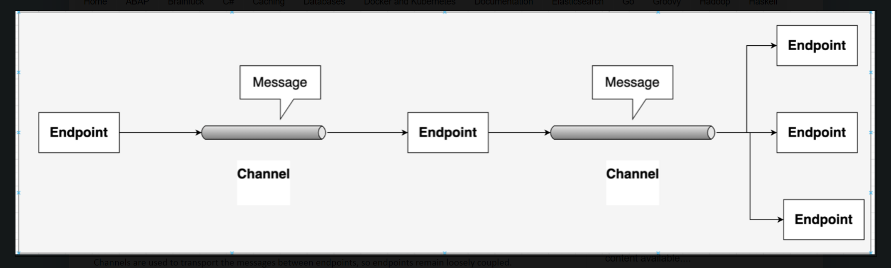

## Spring Integration Demo Example

In Spring integration, message channels are used to transfer message from one endpoint to other endpoint. Producers send message to a channel and consumers receive messages from a channel.

MessageChannel is the core interface provided by spring integration, all other channels implements this interface.

MessageChannel support both point-to-point and Publish-Subscribe semantics.

i) In Point-to-point channel model, one consumer receive the message from a channel at any point of time, that means a message is delivered to once  consumer atmost.

ii) In publish-subscribe channel model, a message is delivered to all the subscribers.

